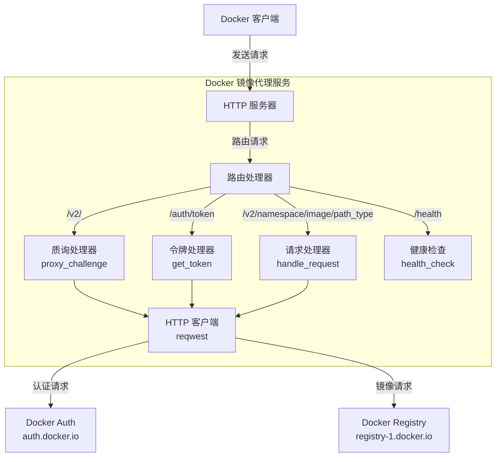
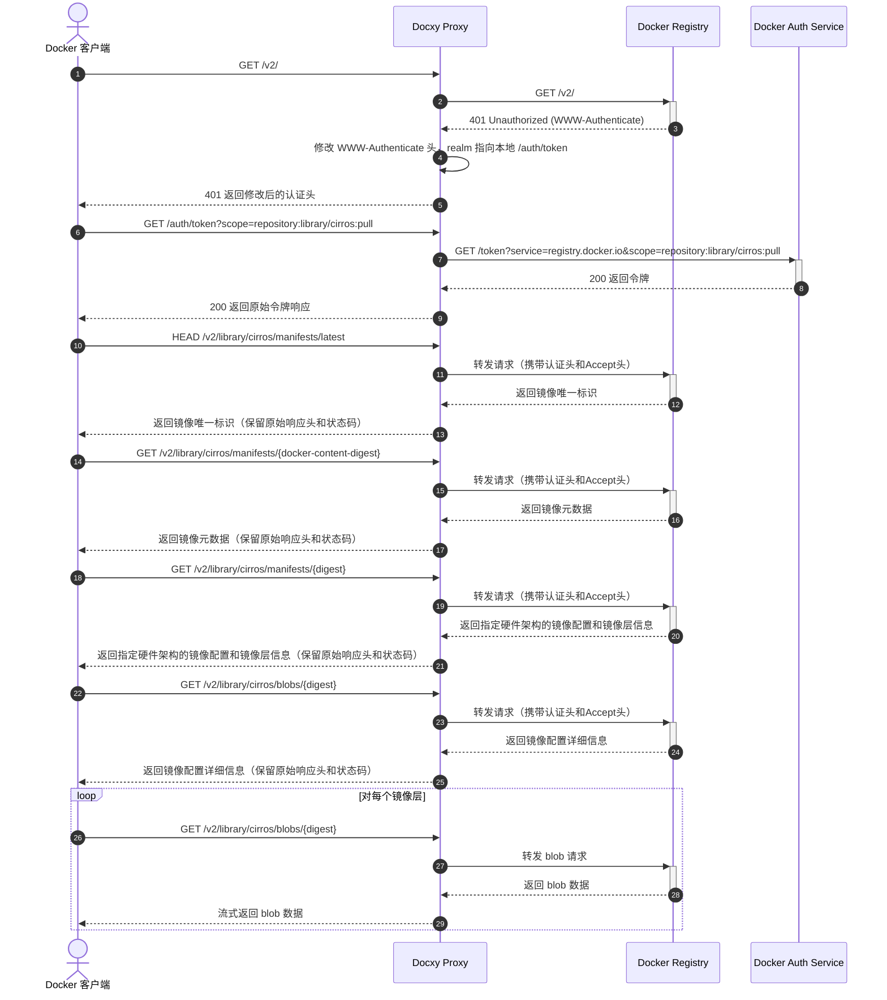

# Docxy 技术架构与原理

本文档详细介绍了 Docxy 项目的背景、技术原理、系统架构和实现流程。

## 背景

### Docker 镜像仓库简介

Docker 镜像仓库是存储和分发 Docker 容器镜像的服务，为容器化应用提供中心化存储。这些仓库允许开发者推送、存储、管理和拉取容器镜像，简化了应用的分发和部署流程。

### 镜像仓库类型

- **官方镜像仓库**：Docker Hub，由 Docker 公司维护的官方仓库
- **第三方独立镜像仓库**：如 AWS ECR、Google GCR、阿里云 ACR 等，用于发布和共享自有镜像
- **镜像加速服务**：如清华 TUNA 镜像站、阿里云镜像加速器等，提供 Docker Hub 的镜像加速服务

> [!NOTE]
> 受网络限制影响，国内直接访问 Docker Hub 困难，多数镜像加速服务也已停止服务。

### 为什么需要镜像代理

镜像代理是连接 Docker 客户端与 Docker Hub 的中间层服务，不存储实际镜像，仅转发请求，有效解决：

- 网络访问限制问题
- 提升镜像下载速度

Docxy 就是这样一个镜像代理服务，目标是通过自建镜像代理，绕过网络封锁并加速镜像下载。

### 镜像代理的使用限制

Docker Hub 对镜像拉取实施了严格的速率限制策略，使用代理服务时，存在以下限制:

- 如果未登录，每个 IP 地址每小时仅允许拉取 10 次镜像
- 如果使用个人账户登录，每小时可以拉取 100 次镜像
- 其他类型账户的具体限制请参考下表：

| 用户类型                     | pull 速率限制     |
| ---------------------------- | ----------------- |
| Business (authenticated)     | 无限制            |
| Team (authenticated)         | 无限制            |
| Pro (authenticated)          | 无限制            |
| **Personal (authenticated)** | **100/小时/账户** |
| **Unauthenticated users**    | **10/小时/IP**    |

## 技术原理

Docxy 实现了完整的 Docker Registry API 代理，仅需添加 Docker 客户端代理配置即可使用。

### 系统架构

### 请求流程

## 其它方案

- [Cloudflare Worker 实现镜像代理](https://voxsay.com/posts/china-docker-registry-proxy-guide/#2%E4%BD%BF%E7%94%A8-cloudflare-worker-%E8%87%AA%E5%BB%BA-docker-%E9%95%9C%E5%83%8F%E4%BB%A3%E7%90%86:~:text=%E9%95%9C%E5%83%8F%E4%BB%A3%E7%90%86%E3%80%82-,2.%E4%BD%BF%E7%94%A8%20Cloudflare%20Worker%20%E8%87%AA%E5%BB%BA%20Docker%20%E9%95%9C%E5%83%8F%E4%BB%A3%E7%90%86,-%E4%BD%BF%E7%94%A8%20Cloudflare%20Worker)：谨慎使用，可能导致 Cloudflare 封号。
- [Nginx 实现镜像代理](https://voxsay.com/posts/china-docker-registry-proxy-guide/#1%E4%BD%BF%E7%94%A8-nginx-%E8%87%AA%E5%BB%BA-docker-%E9%95%9C%E5%83%8F%E4%BB%A3%E7%90%86:~:text=%E5%83%8F%E4%BB%A3%E7%90%86%E7%AB%99-,1.%E4%BD%BF%E7%94%A8%20Nginx%20%E8%87%AA%E5%BB%BA%20Docker%20%E9%95%9C%E5%83%8F%E4%BB%A3%E7%90%86,-%E4%BA%86%E8%A7%A3%E5%AE%8C%E7%BD%91%E7%BB%9C)：仅代理了 registry-1.docker.io，还存在发往 auth.docker.io 的请求，一旦 auth.docker.io 也被封锁，将无法正常使用。