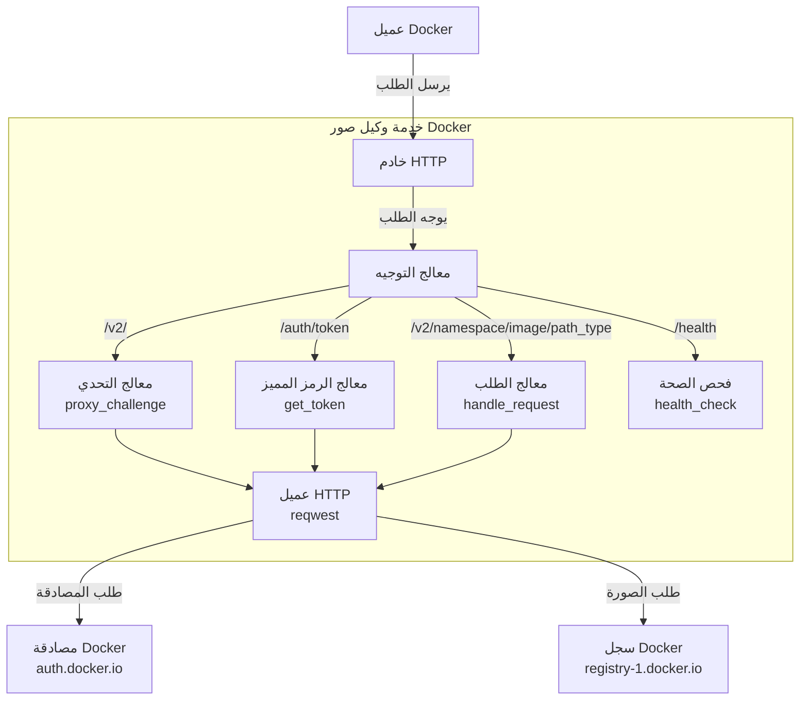
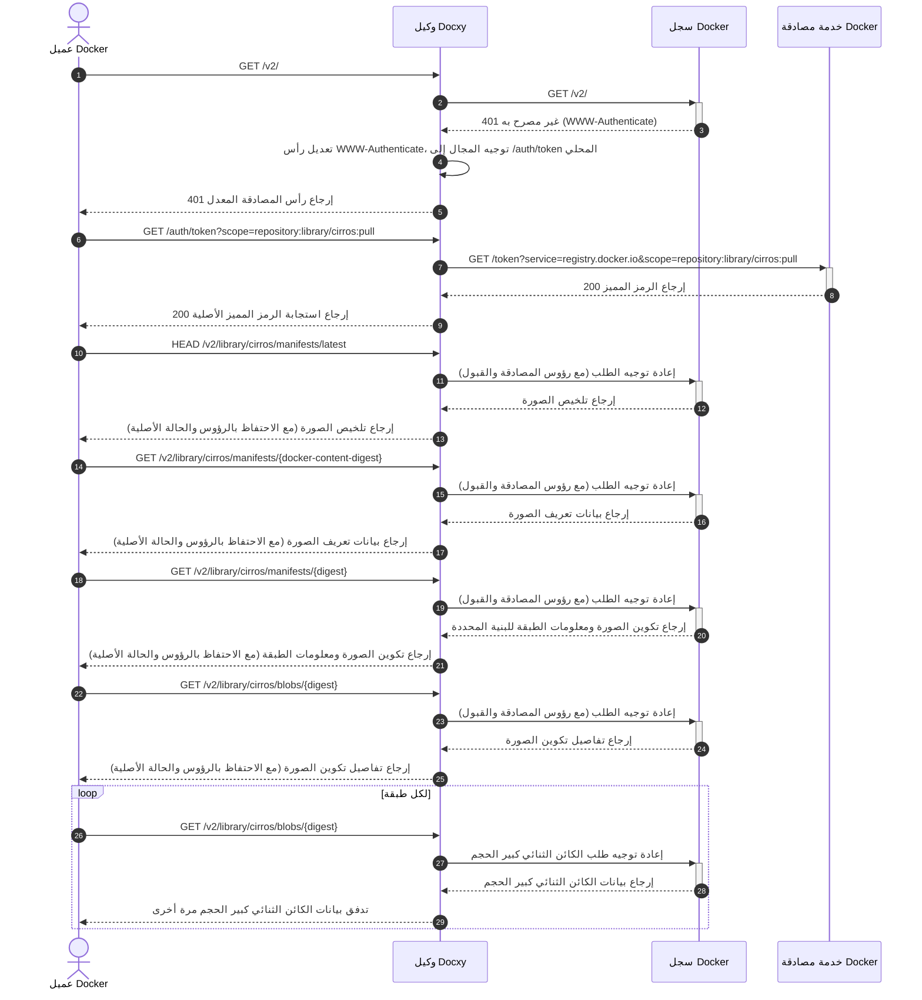

# Docxy البنية التقنية والمبادئ

توضح هذه الوثيقة الخلفية والمبادئ التقنية وهندسة النظام وتدفق التنفيذ لمشروع Docxy.

## الخلفية

### مقدمة إلى سجلات صور Docker

سجل صور Docker هو خدمة لتخزين وتوزيع صور حاويات Docker، مما يوفر تخزينًا مركزيًا للتطبيقات المعبأة في حاويات. تسمح هذه السجلات للمطورين بدفع وتخزين وإدارة وسحب صور الحاويات، مما يبسط عملية توزيع التطبيقات ونشرها.

### أنواع سجلات الصور

- **السجل الرسمي**: Docker Hub، السجل الرسمي الذي تحتفظ به شركة Docker, Inc.
- **سجلات الجهات الخارجية المستقلة**: مثل AWS ECR، Google GCR، Aliyun ACR، وما إلى ذلك، المستخدمة لنشر ومشاركة الصور الخاصة.
- **خدمات المرآة**: مثل موقع مرآة TUNA في جامعة تسينغهوا، ومسرع مرآة Aliyun، وما إلى ذلك، والتي توفر تسريعًا لـ Docker Hub.

> [!NOTE]
> بسبب قيود الشبكة، يصعب الوصول المباشر إلى Docker Hub من داخل البر الرئيسي للصين، وقد توقفت معظم خدمات المرآة عن العمل.

### لماذا هناك حاجة إلى وكيل السجل

وكيل الصور هو خدمة وسيطة تربط عميل Docker بـ Docker Hub. لا يخزن الصور الفعلية ولكنه يعيد توجيه الطلبات فقط، مما يحل بفعالية:

- مشاكل قيود الوصول إلى الشبكة
- تحسين سرعات تنزيل الصور

Docxy هي خدمة وكيل صور تهدف إلى تجاوز الحصار الشبكي وتسريع تنزيلات الصور عن طريق استضافة وكيل ذاتي.

### حدود استخدام وكيل الصور

يفرض Docker Hub سياسات صارمة لتحديد معدل سحب الصور. عند استخدام خدمة وكيل، تنطبق القيود التالية:

- للمستخدمين غير المصادق عليهم، يُسمح بحد أقصى 10 سحوبات للصور في الساعة لكل عنوان IP.
- للمستخدمين الذين قاموا بتسجيل الدخول باستخدام حساب شخصي، يُسمح بـ 100 سحب للصور في الساعة.
- للاطلاع على حدود أنواع الحسابات الأخرى، يرجى الرجوع إلى الجدول أدناه:

| نوع المستخدم                 | حد معدل السحب           |
| ---------------------------- | ------------------------ |
| Business (authenticated)     | غير محدود                |
| Team (authenticated)         | غير محدود                |
| Pro (authenticated)          | غير محدود                |
| **Personal (authenticated)** | **100/ساعة/حساب**        |
| **Unauthenticated users**    | **10/ساعة/IP**          |

## المبادئ التقنية

ينفذ Docxy وكيلًا كاملاً لواجهة برمجة تطبيقات سجل Docker، ويتطلب فقط إضافة تكوين وكيل في عميل Docker لاستخدامه.

### هندسة النظام

### تدفق الطلب

## حلول أخرى

- [Cloudflare Worker لوكيل الصور](https://voxsay.com/posts/china-docker-registry-proxy-guide/): استخدم بحذر، فقد يؤدي ذلك إلى حظر حسابك على Cloudflare.
- [Nginx لوكيل الصور](https://voxsay.com/posts/china-docker-registry-proxy-guide/): هذا يقوم فقط بوكالة `registry-1.docker.io`. لا تزال الطلبات إلى `auth.docker.io` تتم مباشرة، لذلك إذا تم حظر `auth.docker.io` أيضًا، فسيفشل هذا الحل.
