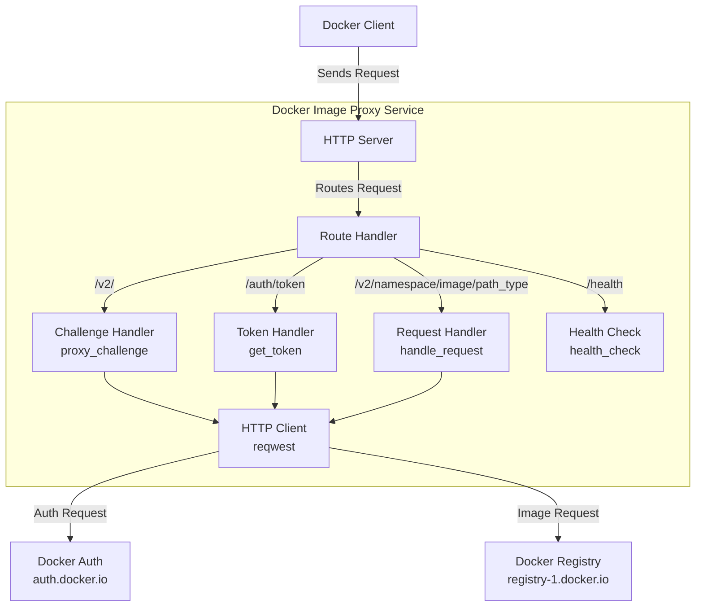
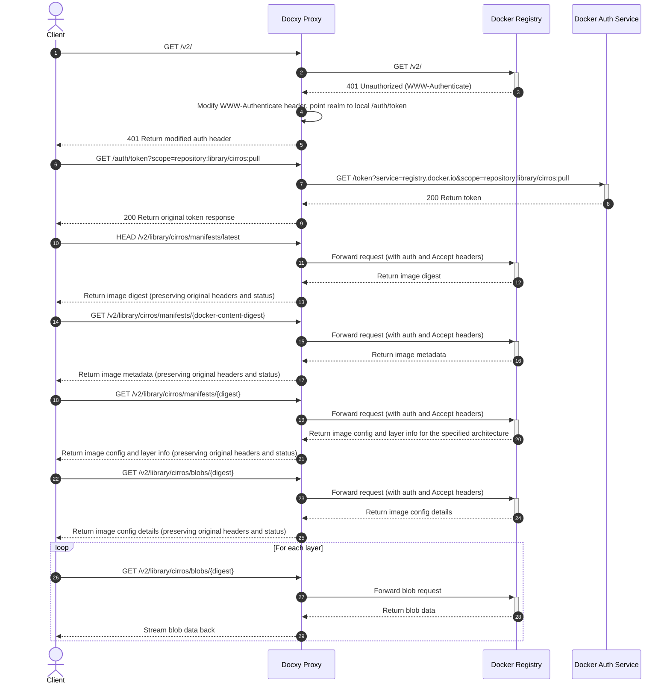

# Docxy Technical Architecture & Principles

This document details the background, technical principles, system architecture, and implementation flow of the Docxy project.

## Background

### Introduction to Docker Image Registries

A Docker image registry is a service for storing and distributing Docker container images, providing centralized storage for containerized applications. These registries allow developers to push, store, manage, and pull container images, simplifying the application distribution and deployment process.

### Types of Image Registries

- **Official Registry**: Docker Hub, the official registry maintained by Docker, Inc.
- **Third-party Standalone Registries**: Such as AWS ECR, Google GCR, Aliyun ACR, etc., used for publishing and sharing proprietary images.
- **Mirror Services**: Such as the TUNA mirror site at Tsinghua University, Aliyun's mirror accelerator, etc., which provide acceleration for Docker Hub.

> [!NOTE]
> Due to network restrictions, direct access to Docker Hub from within mainland China is difficult, and most mirror services have ceased operation.

### Why a Registry Proxy is Needed

An image proxy is an intermediary service that connects the Docker client with Docker Hub. It does not store the actual images but only forwards requests, effectively solving:

- Network access restriction issues
- Improving image download speeds

Docxy is such an image proxy service, aiming to bypass network blockades and accelerate image downloads by self-hosting a proxy.

### Usage Limits of an Image Proxy

Docker Hub imposes strict rate-limiting policies on image pulls. When using a proxy service, the following limits apply:

- For unauthenticated users, a maximum of 10 image pulls per hour per IP address is allowed.
- For users logged in with a personal account, 100 image pulls per hour are allowed.
- For limits on other account types, please refer to the table below:

| User Type                    | Pull Rate Limit        |
| ---------------------------- | ---------------------- |
| Business (authenticated)     | Unlimited              |
| Team (authenticated)         | Unlimited              |
| Pro (authenticated)          | Unlimited              |
| **Personal (authenticated)** | **100/hour/account**   |
| **Unauthenticated users**    | **10/hour/IP**         |

## Technical Principles

Docxy implements a complete proxy for the Docker Registry API, requiring only the addition of a proxy configuration in the Docker client to be used.

### System Architecture

### Request Flow

## Other Solutions

- [Cloudflare Worker for Image Proxy](https://voxsay.com/posts/china-docker-registry-proxy-guide/): Use with caution, as it may lead to your Cloudflare account being banned.
- [Nginx for Image Proxy](https://voxsay.com/posts/china-docker-registry-proxy-guide/): This only proxies `registry-1.docker.io`. Requests to `auth.docker.io` are still made directly, so if `auth.docker.io` is also blocked, this solution will fail.
