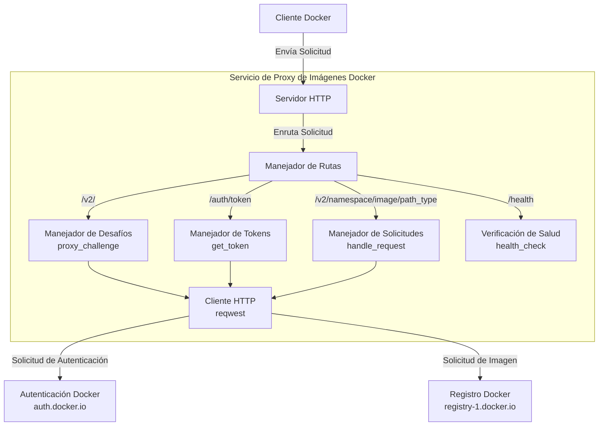
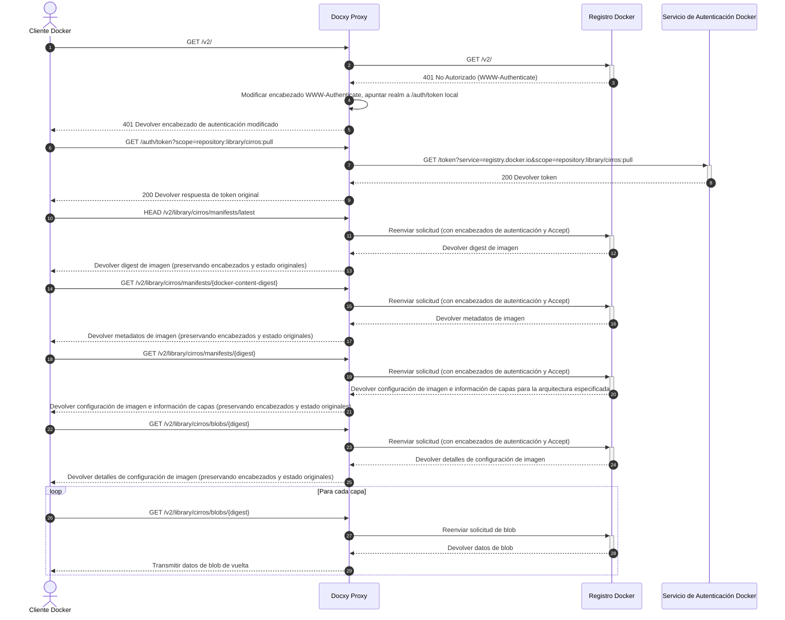

# Docxy Arquitectura Técnica y Principios

Este documento detalla los antecedentes, principios técnicos, arquitectura del sistema y flujo de implementación del proyecto Docxy.

## Antecedentes

### Introducción a los Registros de Imágenes Docker

Un registro de imágenes Docker es un servicio para almacenar y distribuir imágenes de contenedores Docker, proporcionando almacenamiento centralizado para aplicaciones en contenedores. Estos registros permiten a los desarrolladores enviar, almacenar, gestionar y extraer imágenes de contenedores, simplificando el proceso de distribución e implementación de aplicaciones.

### Tipos de Registros de Imágenes

- **Registro Oficial**: Docker Hub, el registro oficial mantenido por Docker, Inc.
- **Registros Independientes de Terceros**: Como AWS ECR, Google GCR, Aliyun ACR, etc., utilizados para publicar y compartir imágenes propietarias.
- **Servicios de Espejo**: Como el sitio espejo TUNA en la Universidad de Tsinghua, el acelerador de espejos de Aliyun, etc., que proporcionan aceleración para Docker Hub.

> [!NOTE]
> Debido a las restricciones de red, el acceso directo a Docker Hub desde China continental es difícil, y la mayoría de los servicios de espejo han cesado sus operaciones.

### Por qué se necesita un Proxy de Registro

Un proxy de imágenes es un servicio intermediario que conecta el cliente Docker con Docker Hub. No almacena las imágenes reales, sino que solo reenvía las solicitudes, resolviendo eficazmente:

- Problemas de restricción de acceso a la red
- Mejora de la velocidad de descarga de imágenes

Docxy es un servicio de proxy de imágenes, cuyo objetivo es eludir los bloqueos de red y acelerar las descargas de imágenes mediante el autoalojamiento de un proxy.

### Límites de Uso de un Proxy de Imágenes

Docker Hub impone estrictas políticas de limitación de velocidad en las extracciones de imágenes. Al usar un servicio de proxy, se aplican los siguientes límites:

- Para usuarios no autenticados, se permite un máximo de 10 extracciones de imágenes por hora por dirección IP.
- Para usuarios que han iniciado sesión con una cuenta personal, se permiten 100 extracciones de imágenes por hora.
- Para los límites de otros tipos de cuenta, consulte la tabla a continuación:

| Tipo de Usuario              | Límite de Tasa de Extracción |
| ---------------------------- | ---------------------------- |
| Business (authenticated)     | Ilimitado                    |
| Team (authenticated)         | Ilimitado                    |
| Pro (authenticated)          | Ilimitado                    |
| **Personal (authenticated)** | **100/hora/cuenta**          |
| **Unauthenticated users**    | **10/hora/IP**               |

## Principios Técnicos

Docxy implementa un proxy completo para la API de Docker Registry, requiriendo solo la adición de una configuración de proxy en el cliente Docker para ser utilizado.

### Arquitectura del Sistema

### Flujo de Solicitudes

## Otras Soluciones

- [Cloudflare Worker para Proxy de Imágenes](https://voxsay.com/posts/china-docker-registry-proxy-guide/): Usar con precaución, ya que puede llevar a la suspensión de su cuenta de Cloudflare.
- [Nginx para Proxy de Imágenes](https://voxsay.com/posts/china-docker-registry-proxy-guide/): Esto solo proxy `registry-1.docker.io`. Las solicitudes a `auth.docker.io` aún se realizan directamente, por lo que si `auth.docker.io` también está bloqueado, esta solución fallará.
