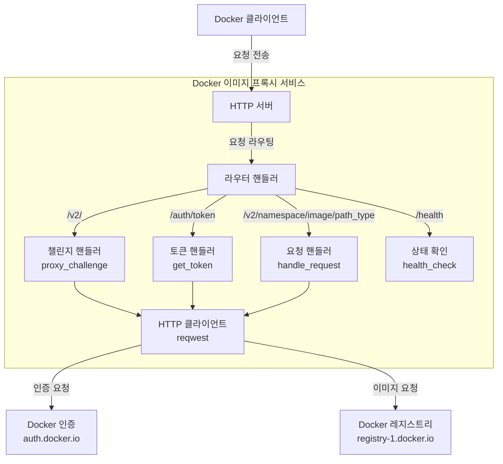
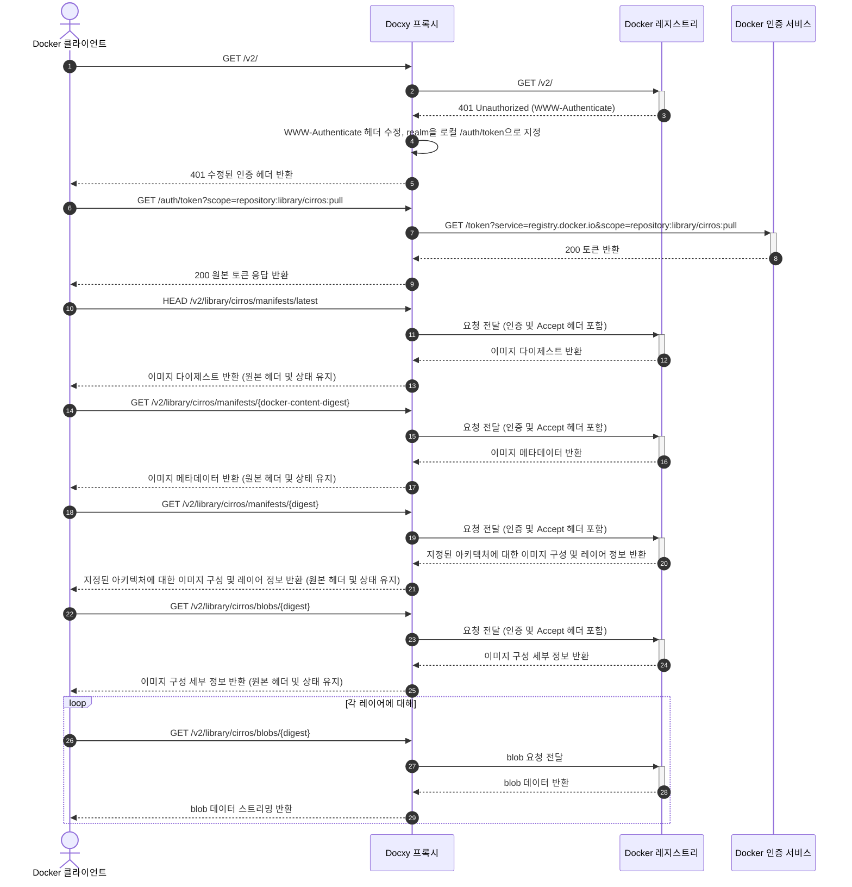

# Docxy 기술 아키텍처 및 원리

이 문서는 Docxy 프로젝트의 배경, 기술 원리, 시스템 아키텍처 및 구현 흐름을 자세히 설명합니다.

## 배경

### Docker 이미지 레지스트리 소개

Docker 이미지 레지스트리는 Docker 컨테이너 이미지를 저장하고 배포하는 서비스로, 컨테이너화된 애플리케이션을 위한 중앙 집중식 스토리지를 제공합니다. 이러한 레지스트리는 개발자가 컨테이너 이미지를 푸시, 저장, 관리 및 풀할 수 있도록 하여 애플리케이션 배포 및 배포 프로세스를 단순화합니다.

### 이미지 레지스트리 유형

- **공식 레지스트리**: Docker, Inc.에서 유지 관리하는 공식 레지스트리인 Docker Hub
- **타사 독립형 레지스트리**: AWS ECR, Google GCR, Aliyun ACR 등과 같이 독점 이미지를 게시하고 공유하는 데 사용됩니다.
- **미러 서비스**: 칭화대학교 TUNA 미러 사이트, Aliyun의 미러 가속기 등과 같이 Docker Hub에 대한 가속을 제공합니다.

> [!NOTE]
> 네트워크 제한으로 인해 중국 본토에서 Docker Hub에 직접 액세스하기 어렵고, 대부분의 미러 서비스가 운영을 중단했습니다.

### 레지스트리 프록시가 필요한 이유

이미지 프록시는 Docker 클라이언트와 Docker Hub를 연결하는 중간 서비스입니다. 실제 이미지를 저장하지 않고 요청만 전달하여 다음을 효과적으로 해결합니다.

- 네트워크 액세스 제한 문제
- 이미지 다운로드 속도 향상

Docxy는 이러한 이미지 프록시 서비스로, 자체 호스팅 프록시를 통해 네트워크 차단을 우회하고 이미지 다운로드를 가속화하는 것을 목표로 합니다.

### 이미지 프록시 사용 제한

Docker Hub는 이미지 풀에 엄격한 속도 제한 정책을 적용합니다. 프록시 서비스를 사용할 때 다음 제한이 적용됩니다.

- 인증되지 않은 사용자의 경우 IP 주소당 시간당 최대 10회 이미지 풀이 허용됩니다.
- 개인 계정으로 로그인한 사용자의 경우 시간당 100회 이미지 풀이 허용됩니다.
- 다른 계정 유형에 대한 제한은 아래 표를 참조하십시오.

| 사용자 유형                  | 풀 속도 제한             |
| ---------------------------- | ------------------------ |
| Business (authenticated)     | 무제한                   |
| Team (authenticated)         | 무제한                   |
| Pro (authenticated)          | 무제한                   |
| **Personal (authenticated)** | **시간당 100회/계정**    |
| **Unauthenticated users**    | **시간당 10회/IP**       |

## 기술 원리

Docxy는 Docker Registry API에 대한 완전한 프록시를 구현하며, 사용하려면 Docker 클라이언트에 프록시 구성을 추가하기만 하면 됩니다.

### 시스템 아키텍처

### 요청 흐름

## 기타 솔루션

- [Cloudflare Worker를 이용한 이미지 프록시](https://voxsay.com/posts/china-docker-registry-proxy-guide/): Cloudflare 계정 정지로 이어질 수 있으므로 주의해서 사용하십시오.
- [Nginx를 이용한 이미지 프록시](https://voxsay.com/posts/china-docker-registry-proxy-guide/): `registry-1.docker.io`만 프록시합니다. `auth.docker.io`에 대한 요청은 여전히 직접 이루어지므로, `auth.docker.io`도 차단되면 이 솔루션은 작동하지 않습니다.
