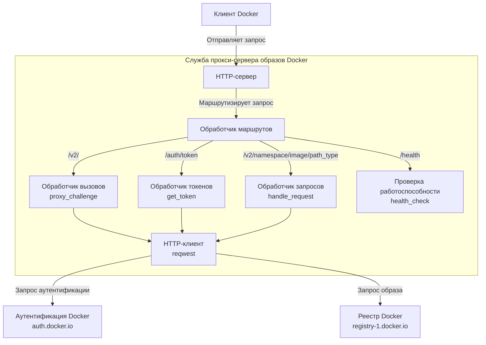
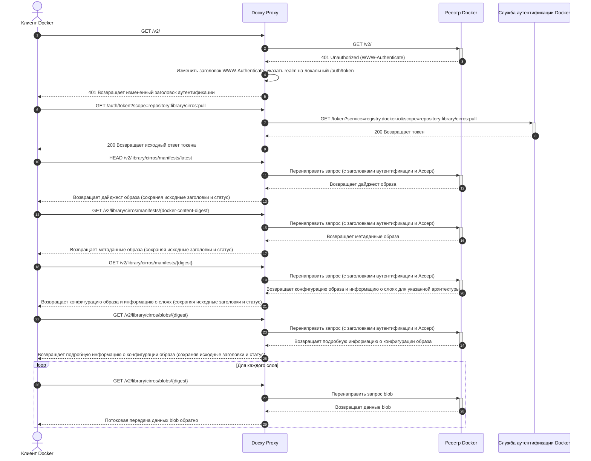

# Docxy Техническая архитектура и принципы

Этот документ подробно описывает фон, технические принципы, системную архитектуру и процесс реализации проекта Docxy.

## Фон

### Введение в реестры образов Docker

Реестр образов Docker — это служба для хранения и распространения образов контейнеров Docker, обеспечивающая централизованное хранение для контейнеризированных приложений. Эти реестры позволяют разработчикам отправлять, хранить, управлять и извлекать образы контейнеров, упрощая процесс распространения и развертывания приложений.

### Типы реестров образов

- **Официальный реестр**: Docker Hub, официальный реестр, поддерживаемый Docker, Inc.
- **Сторонние автономные реестры**: Такие как AWS ECR, Google GCR, Aliyun ACR и т. д., используемые для публикации и обмена проприетарными образами.
- **Зеркальные службы**: Такие как зеркальный сайт TUNA в Университете Цинхуа, ускоритель зеркал Aliyun и т. д., которые обеспечивают ускорение для Docker Hub.

> [!NOTE]
> Из-за сетевых ограничений прямой доступ к Docker Hub из материкового Китая затруднен, и большинство зеркальных служб прекратили свою работу.

### Зачем нужен прокси-сервер реестра

Прокси-сервер образов — это промежуточная служба, которая соединяет клиент Docker с Docker Hub. Он не хранит фактические образы, а только перенаправляет запросы, эффективно решая:

- Проблемы с ограничениями доступа к сети
- Увеличение скорости загрузки образов

Docxy — это такая служба прокси-сервера образов, целью которой является обход сетевых блокировок и ускорение загрузки образов путем самостоятельного размещения прокси-сервера.

### Ограничения использования прокси-сервера образов

Docker Hub налагает строгие политики ограничения скорости на извлечение образов. При использовании прокси-сервера применяются следующие ограничения:

- Для неаутентифицированных пользователей разрешено не более 10 извлечений образов в час на IP-адрес.
- Для пользователей, вошедших в систему с личной учетной записью, разрешено 100 извлечений образов в час.
- Ограничения для других типов учетных записей см. в таблице ниже:

| Тип пользователя             | Ограничение скорости извлечения |
| ---------------------------- | ------------------------------- |
| Business (authenticated)     | Без ограничений                 |
| Team (authenticated)         | Без ограничений                 |
| Pro (authenticated)          | Без ограничений                 |
| **Personal (authenticated)** | **100/час/учетная запись**      |
| **Unauthenticated users**    | **10/час/IP**                   |

## Технические принципы

Docxy реализует полный прокси для Docker Registry API, для использования требуется только добавление конфигурации прокси в клиент Docker.

### Системная архитектура

### Поток запросов

## Другие решения

- [Cloudflare Worker для прокси образов](https://voxsay.com/posts/china-docker-registry-proxy-guide/): Используйте с осторожностью, так как это может привести к блокировке вашей учетной записи Cloudflare.
- [Nginx для прокси образов](https://voxsay.com/posts/china-docker-registry-proxy-guide/): Это проксирует только `registry-1.docker.io`. Запросы к `auth.docker.io` по-прежнему выполняются напрямую, поэтому, если `auth.docker.io` также заблокирован, это решение не будет работать.
