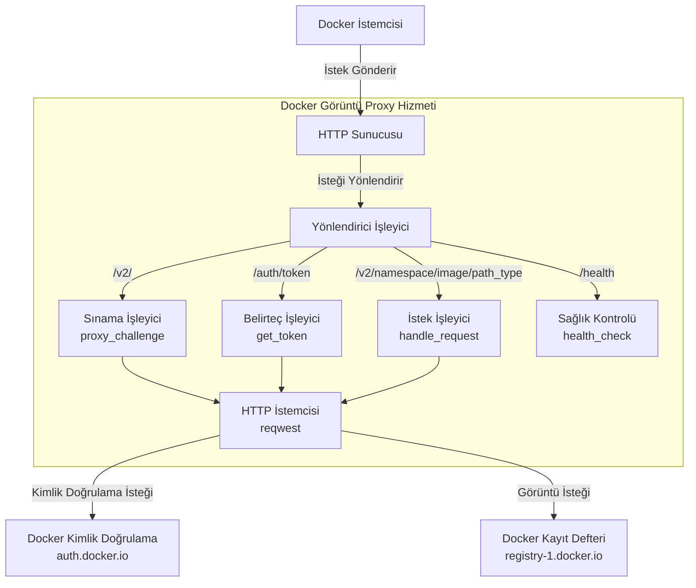
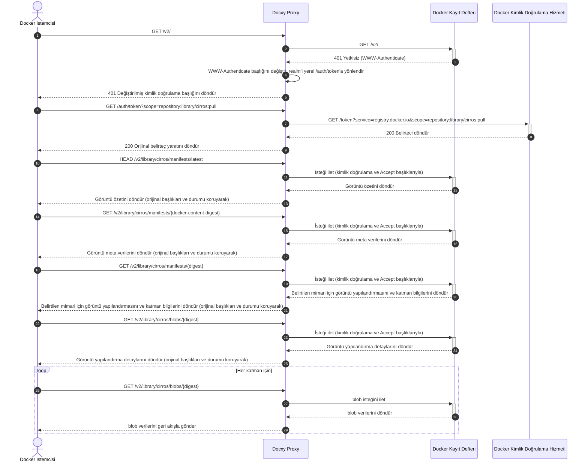

# Docxy Teknik Mimari ve Prensipler

Bu belge, Docxy projesinin arka planını, teknik prensiplerini, sistem mimarisini ve uygulama akışını detaylandırmaktadır.

## Arka Plan

### Docker Görüntü Kayıt Defterlerine Giriş

Docker görüntü kayıt defteri, Docker kapsayıcı görüntülerini depolamak ve dağıtmak için bir hizmettir ve kapsayıcılı uygulamalar için merkezi depolama sağlar. Bu kayıt defterleri, geliştiricilerin kapsayıcı görüntülerini göndermesine, depolamasına, yönetmesine ve çekmesine olanak tanıyarak uygulama dağıtım ve yerleştirme sürecini basitleştirir.

### Görüntü Kayıt Defteri Türleri

- **Resmi Kayıt Defteri**: Docker, Inc. tarafından yönetilen resmi kayıt defteri olan Docker Hub.
- **Üçüncü Taraf Bağımsız Kayıt Defterleri**: AWS ECR, Google GCR, Aliyun ACR vb. gibi tescilli görüntüleri yayınlamak ve paylaşmak için kullanılır.
- **Ayna Hizmetleri**: Tsinghua Üniversitesi'ndeki TUNA ayna sitesi, Aliyun'un ayna hızlandırıcısı vb. gibi Docker Hub için hızlandırma sağlayan hizmetler.

> [!NOTE]
> Ağ kısıtlamaları nedeniyle, Çin anakarasından Docker Hub'a doğrudan erişim zordur ve çoğu ayna hizmeti faaliyetlerini durdurmuştur.

### Neden Bir Kayıt Defteri Proxy'sine İhtiyaç Duyulur?

Bir görüntü proxy'si, Docker istemcisini Docker Hub ile bağlayan bir aracı hizmettir. Gerçek görüntüleri depolamaz, yalnızca istekleri iletir ve aşağıdaki sorunları etkili bir şekilde çözer:

- Ağ erişim kısıtlamaları sorunları
- Görüntü indirme hızlarını artırma

Docxy, ağ engellemelerini aşmayı ve görüntü indirmelerini hızlandırmayı amaçlayan böyle bir görüntü proxy hizmetidir.

### Görüntü Proxy'sinin Kullanım Limitleri

Docker Hub, görüntü çekme işlemlerinde katı hız sınırlama politikaları uygulamaktadır. Bir proxy hizmeti kullanırken aşağıdaki sınırlar geçerlidir:

- Kimliği doğrulanmamış kullanıcılar için IP adresi başına saatte en fazla 10 görüntü çekme işlemine izin verilir.
- Kişisel bir hesapla oturum açmış kullanıcılar için saatte 100 görüntü çekme işlemine izin verilir.
- Diğer hesap türleri için limitler için lütfen aşağıdaki tabloya bakın:

| Kullanıcı Türü               | Çekme Hızı Limiti        |
| ---------------------------- | ------------------------ |
| Business (authenticated)     | Sınırsız                 |
| Team (authenticated)         | Sınırsız                 |
| Pro (authenticated)          | Sınırsız                 |
| **Personal (authenticated)** | **100/saat/hesap**       |
| **Unauthenticated users**    | **10/saat/IP**           |

## Teknik Prensipler

Docxy, Docker Kayıt Defteri API'si için eksiksiz bir proxy uygular ve kullanılmak üzere Docker istemcisine yalnızca bir proxy yapılandırması eklenmesini gerektirir.

### Sistem Mimarisi

### İstek Akışı

## Diğer Çözümler

- [Görüntü Proxy'si için Cloudflare Worker](https://voxsay.com/posts/china-docker-registry-proxy-guide/): Dikkatli kullanın, Cloudflare hesabınızın askıya alınmasına neden olabilir.
- [Görüntü Proxy'si için Nginx](https://voxsay.com/posts/china-docker-registry-proxy-guide/): Bu yalnızca `registry-1.docker.io`'yu proxy'ler. `auth.docker.io`'ya yapılan istekler hala doğrudan yapılır, bu nedenle `auth.docker.io` da engellenirse bu çözüm çalışmayacaktır.